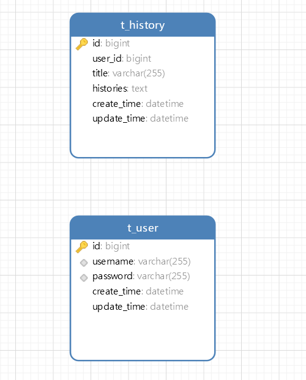

## 修订历史记录

| 版本 | 日期     | AMD  | 修订者 | 说明           |
| ---- | -------- | ---- | ------ | -------------- |
| V1.0 | 20240625 | A    | 彭铭琨 | 新增数据库设计 |
|      |          |      |        |                |
|      |          |      |        |                |
|      |          |      |        |                |
|      |          |      |        |                |
|      |          |      |        |                |
|      |          |      |        |                |

（A-添加，M-修改，D-删除）

## 1. 引言

### 1.1 文档目的

本文档描述了数据库的设计，包括用户表和对话记录表的详细结构及其字段说明。该设计用于支持用户管理和对话记录管理功能。

### 1.2 术语定义

· UUID：通用唯一识别码，用于唯一标识记录。

· PK：主键，唯一标识表中的记录。

· Not Null：字段不能为空。

· Varchar：可变长度字符数据类型。

· Datetime：日期时间数据类型。

 

### 1.3 参考资料

表 1.3-1 参考资料表

| 序号 | 文档名称                                | 版本 | 作者   |
| ---- | --------------------------------------- | ---- | ------ |
| 1    | 东莞理工学院RustChatGPT数据库设计说明书 | V1.0 | 彭铭琨 |

## 2 运行环境与架构设计

### 2.1 数据库环境说明

数据库部署在本地上，数据库环境为项目本地的环境。

### 2.2 支持软件

数据库管理系统软件为 MySQL。

MySQL是一个[关系型数据库管理系统](https://baike.baidu.com/item/关系型数据库管理系统/696511?fromModule=lemma_inlink)，由瑞典 [MySQL AB](https://baike.baidu.com/item/MySQL AB/2620844?fromModule=lemma_inlink) 公司开发，属于 [Oracle](https://baike.baidu.com/item/Oracle/301207?fromModule=lemma_inlink) 旗下产品。MySQL是最流行的[关系型数据库管理系统](https://baike.baidu.com/item/关系型数据库管理系统/696511?fromModule=lemma_inlink)之一，在 [WEB](https://baike.baidu.com/item/WEB/150564?fromModule=lemma_inlink) 应用方面，MySQL是最好的[RDBMS](https://baike.baidu.com/item/RDBMS/1048260?fromModule=lemma_inlink) (Relational Database Management System，[关系数据库管理系统](https://baike.baidu.com/item/关系数据库管理系统/11032386?fromModule=lemma_inlink))应用软件之一。

## 3 数据库的命名规则

### 3.1 基本对象命名规范参照表

主要介绍数据库对象名的命名规则，主要的数据库对象包含：触发器（Trigger）、 表（Table）、视图（View）、存储过程（StoredProcedure）、索引（Index）、缺 省值（Default）、图表（Diagram）、用户（User）、规则（Rule）等。以下范例 仅供参考。

表 3.1-1 数据库命名规则

| 序号 | 类型                  | 前缀 | 范例                      |
| ---- | --------------------- | ---- | ------------------------- |
| 1    | 表（table）           | t_   | t_user_info               |
| 2    | 视图（view）          | v_   | v_user_info               |
| 3    | 序列（sequence）      | seq  | seq_user_info             |
| 4    | 簇（cluster）         | c_   | c_user_info               |
| 5    | 触发器（trigger）     | trg_ | trg_user_info             |
| 6    | 存储过程（procedure） | pro  | pro_user_info             |
| 7    | 函数（function）      | fn_  | fn_user_info/f_ user_info |

### 3.2 数据库命名规范

一、数据库名命名规范

采用 26个英文字母 (区分大小写)  和 0-9 的自然数 (一般不需要) 加上下划 线 ‘_’  组成，命名简介明确 (Student_Union)，多个单词用下划线 ‘_’ 分隔，一个 项目一个数据库，多个项目慎用同一个数据库。

二、表名命名规范

- 1.  采用 26字母和 0-9的自然数（一般不使用）加上下互相 ‘_’ 组成，命名简洁明确，多个单词用下划线 ‘  ’ 隔开。
- 2.  全部小写命名，尽量避免出现大写。
- 3.  禁止使用关键字，如：select 、table 、show等。
- 4.  表名称不要取得太长（一般不超过三个英文单词）
- 5.  表的名称一般使用名词或者动宾短语。
- 6.  注意单词形式，列如：使用user，而不是users。
- 7.  表必须填写描述信息（建表时可以用注释详细写出表的作用，不同数据 库的注释都不一样）。

三、字段命名规范

- 1.  采用 26字母和 0-9的自然数（一般不使用）加上下互相 ‘_’ 组成，命名 简洁明确，多个单词用下划线 ‘_’ 隔开。
- 2.  全部小写命名，尽量避免出现大写。
- 3.  字段必须填写描述信息。
- 4.  禁止使用数据库关键字。
- 5.  字段名称一般采用名词或动宾短语。
- 6.  采用字段的名字必须是易于理解，一般不超过三个英文单词。
- 7.  在命名表的列时，不要重复表的名称（如：在 user 表中，出现 user_name 字段）。
- 8.  字段命名使用完整名称。

四、SQL 语言编码规范

- 1.  所有关键字最好大写，如：DELETE 、UPDATE 、INSERT 等。
- 2.  多有函数及其参数中除用户变量以外的部分大写。
- 3.  在定义变量时用到的数据类型小写。

### 3.3 Table（表名）命名规范

表名须以"t_"开头，中间以业务模块名称中文首字母简写，最后跟上表业 务名称。

关于表名使用英文或中文说明，由于用户的原始表以中文首字母简写为主，所以这里按照此规则，我们所有表名按中文首字母简写方式，字段名同理，不能采用中英文混用方式进行。

关于临时备份表名规范，采用表名_BAKn(n为0、1、2、3)结尾，按n的顺序依次表示备份时间的先后，并在注释中标准备份时间和由谁备份，方便以后进行删除，创建表结构是不采用单引号存在的方式，因为单引号会对表名称以及字段名区分大小写操作，确保数据库对象使用不区分大小写。

### 3.4 View（视图名）命名规范

视图名必须以"V_"开头，中间以业务模块名称中文首字母简写，最后跟上视图业务名称，eg:V_QXDA_ZDRYWBGL(V表示view,QXDA表示全息档案，ZDRYWBGL：重点人员网吧关联)；

视图名字段别名命名中英文规则按表名中英文规则；

视图临时备份规范按视图_BAKn(n为0、1、2、3)结尾形式；

### 3.5 Index（索引名）命名规范

索引名必须以"IDX_"开头，中间以表名业务模块名称和表业务名称去下划线，最后跟建立索引的字段名。

针对组合索引和函数索引规范，组合索引"IDXZ_"开头，其余规则不变，若索引名太长，适当取舍字段，函数索引以"IDXF_"开头，其余规则不变；

索引名一定要做到以固定格式开头外，能准确反映在哪个表，那个字段上建立索引关系；

### 3.6 Trigger（触发器）命名规范 

触发器名必须以"TRG_"开头，中间以表名业务模块名称和表业务名称去下划线，再跟触发器名称； 

触发器名一定要做到固定格式开头外，能准确反映在哪个表上建立怎样的触发器；

### 3.7 Sequence（序列）命名规范 

必须以"SEQ_"开头，中间以表名业务模块名称和表业务名称去下划线，最后跟建立序列的名称；序列必须做到固定格式外，能准确反映为哪个表或者视图使用的序列； 

### 3.8 Procedure（程序）命名规范 

存储过程必须以"PRO_"开头，跟下划线业务模块名称中文首字母简写，然后是存储过程名称； 

### 3.9 Function（函数）命名规范 

函数过程必须以"FN_"开头，跟业务模块名称中文首字母简写，然后是函数名称； 

### 3.10 Package（包体）命名规范 

函数过程必须以"FN_"开头，跟业务模块名称中文首字母简写，然后是函数名称；

 

## 4 安全性设计 

数据库每天进行增量备份、一周进行一次全局备份。 

##  5 RustChatGPT项目

### 5.1 数据库表

#### 5.1.1 关系图

#### 5.1.2 表清单

 

### 表 5.1-1 表清单

| 名称      | 注释       |
| --------- | ---------- |
| t_user    | 用户表     |
| t_history | 对话记录表 |

#### 5.1.2.1 用户表<t_user>

| 字段名称    | 数据类型     | 约束条件         | 描述         |
| ----------- | ------------ | ---------------- | ------------ |
| id          | long         | UUID, PK         | 用户ID       |
| username    | VARCHAR(255) | not null, unique | 用户名       |
| password    | VARCHAR(255) | not null, unique | 用户密码     |
| create_time | datetime     |                  | 用户创建日期 |
| update_time | datetime     |                  | 用户更新日期 |

#### 5.1.2.2 对话记录表<t_history>

| 字段名称    | 数据类型     | 约束条件 | 描述         |
| ----------- | ------------ | -------- | ------------ |
| id          | long         | UUID, PK | 对话记录ID   |
| user_id     | long         | not null | 用户id       |
| title       | VARCHAR(255) | not null | 对话标题     |
| histories   | text         |          | 历史对话记录 |
| create_time | datetime     |          | 用户创建日期 |
| update_time | datetime     |          | 用户更新日期 |

 

## 5.2 视图

暂无

 

## 5.3 存储过程

暂无

 

## 5.4 自定义函数

暂无

 

## 5.5 触发器

暂无

 