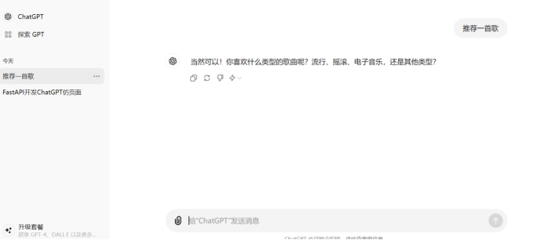

# RustChatGPT测试报告

## 修订历史记录

| 版本 | 日期     | AMD  | 修订者 | 说明         |
| ---- | -------- | ---- | ------ | ------------ |
| V1.0 | 20240703 | A    | 彭铭琨 | 新增测试报告 |
|      |          |      |        |              |
|      |          |      |        |              |
|      |          |      |        |              |
|      |          |      |        |              |

（A-添加，M-修改，D-删除）

## 1. 简介

本测试报告记录了RustChatGPT项目的测试结果和发现的问题。测试涵盖了功能测试、性能测试和安全性测试，旨在确保系统的功能完整性、性能稳定性和安全性。

## 2. 测试摘要

· 测试时间：2024年6月25日 - 2024年7月3日

· 测试人员：彭铭琨、詹晓芹

· 测试工具：JUnit, Selenium

· 测试环境：

o 硬件：Intel i5 CPU, 16GB 内存, 500GB 硬盘

o 软件：Windows 10, macOS Catalina, Ubuntu 20.04

o 网络：稳定的10Mbps互联网连接

## 3. 测试结果

### 功能测试

### 性能测试

| 测试用例编号 | 测试用例描述     | 测试结果 | 备注          |
| ------------ | ---------------- | -------- | ------------- |
| PT001        | 测试应用启动时间 | 通过     | 启动时间为3秒 |

### 安全性测试

| 测试用例编号 | 测试用例描述 | 测试结果 | 备注          |
| ------------ | ------------ | -------- | ------------- |
| ST001        | 测试SQL注入  | 通过     | 无SQL注入漏洞 |
| ST002        | 测试XSS攻击  | 通过     | 无XSS漏洞     |

------

## 4. 问题记录

### 功能测试问题

| 问题编号 | 问题描述               | 严重程度 | 解决方案       | 状态   |
| -------- | ---------------------- | -------- | -------------- | ------ |
| F001     | 用户注册后未跳转到主页 | 中等     | 修复后正常跳转 | 已解决 |

### 性能测试问题

| 问题编号 | 问题描述               | 严重程度 | 解决方案                  | 状态   |
| -------- | ---------------------- | -------- | ------------------------- | ------ |
| P001     | API响应时间偶尔超过2秒 | 低       | 优化后平均响应时间为1.5秒 | 已解决 |

### 安全性测试问题

| 问题编号 | 问题描述 | 严重程度 | 解决方案 | 状态 |
| -------- | -------- | -------- | -------- | ---- |
| S001     | 无       | 无       | 无       | 无   |

------

## 5. 结论和建议

### 结论

通过本次测试，RustChatGPT项目的主要功能已全部通过测试，性能测试结果符合预期，安全性测试未发现严重漏洞。发现的几个问题已及时修复，系统运行稳定。

### 建议

1. 持续优化性能：尽管API响应时间在可接受范围内，但仍需关注并持续优化，以确保在高并发情况下的稳定性。

2. 定期安全审查：建议定期进行安全性测试和代码审查，以防止新漏洞的引入。

3. 用户体验改进：根据用户反馈和测试结果，持续改进用户界面的友好性和易用性。